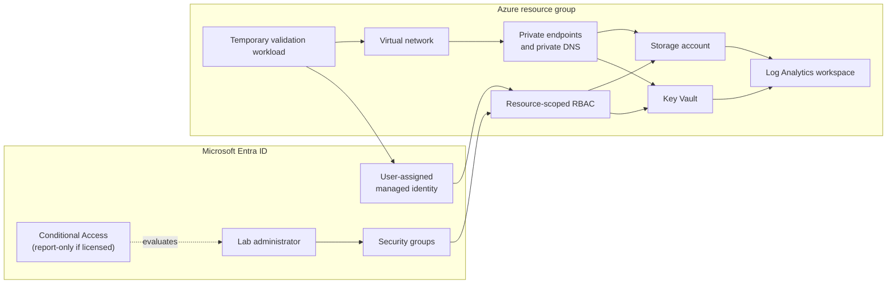

# CareBridge Azure Identity & Workload Security Lab

A small, evidence-led Azure lab that connects Microsoft Entra identity controls to a protected Azure workload for CareBridge Analytics, a fictional healthcare SaaS team.

The scenario is intentionally modest: a fictional healthcare analytics team needs controlled administrator access, a workload identity that does not use stored credentials, private access to secrets and storage, and enough logging to verify the controls. The goal is to demonstrate sound junior-level cloud security practice after SC-300 and SC-500 study—not to present this as production or enterprise architecture experience.

> **Current state:** lab design and deployment automation are being built. Controls will be marked as implemented only after a real Azure validation artifact is recorded.

## What this lab is designed to prove

| Security question | Planned control | Evidence rule |
|---|---|---|
| Who should administer the lab? | Entra security groups and least-privilege Azure RBAC | Sanitized group and role-assignment exports |
| How is risky sign-in policy introduced safely? | Conditional Access in report-only mode with an emergency-access exclusion, when licensing permits | Portal policy summary and sign-in evaluation |
| How does the workload authenticate? | User-assigned managed identity | Identity sign-in and resource access test |
| Can the workload reach secrets and data without public endpoints? | Key Vault and Storage private endpoints, private DNS, and network restrictions | Configuration export plus a successful private-path test |
| Can a reviewer verify what happened? | Diagnostic settings, Log Analytics, and focused KQL | Query text and sanitized result screenshot |

## Intended architecture

The temporary validation workload exists only long enough to prove that the managed identity can use the private data path. It is then removed to control cost.

## Repository tour

- [`docs/01-scope-and-threat-model.md`](docs/01-scope-and-threat-model.md) defines the scenario, assumptions, and control boundaries.
- [`docs/skills-map.md`](docs/skills-map.md) maps implemented artifacts to SC-300 and SC-500 skill areas without turning exam objectives into experience claims.
- [`docs/references.md`](docs/references.md) lists the Microsoft guidance used for the controls.
- [`notes/lab-journal.md`](notes/lab-journal.md) records dated work sessions, failures, decisions, fixes, and retests.
- [`evidence/README.md`](evidence/README.md) is the evidence index and redaction standard.
- `infra/`, `queries/`, and deployment scripts will contain the tested implementation.

## Evidence standard

Screenshots and exports in this repository must come from the real lab tenant or subscription. Tenant IDs, subscription IDs, object IDs, personal email addresses, IP addresses, secrets, tokens, and billing details are removed. Architecture illustrations explain the design; they are not presented as proof.

## Boundaries

- This is an isolated learning environment, not a production tenant.
- Entra Conditional Access, PIM, and access reviews depend on the available tenant license. Unavailable features stay explicitly marked as not implemented.
- A passing deployment is not treated as proof of effective security. Each implemented control needs a configuration check or access test.
- No synthetic portal screens, invented incidents, or backdated work history are used.

## Cost and cleanup

The design uses small, temporary resources. Private endpoints, Log Analytics ingestion, and a validation workload can incur charges. The cleanup script and final resource inventory will be recorded before the lab is considered complete.

## License

[MIT](LICENSE)
