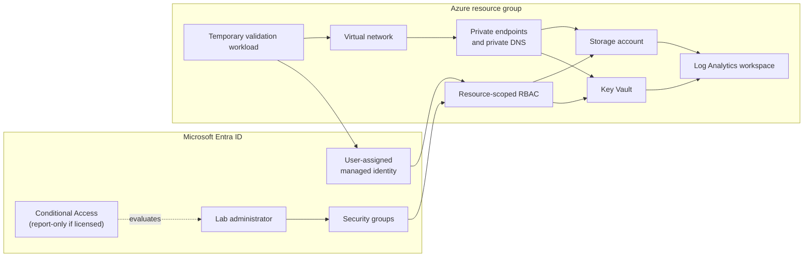
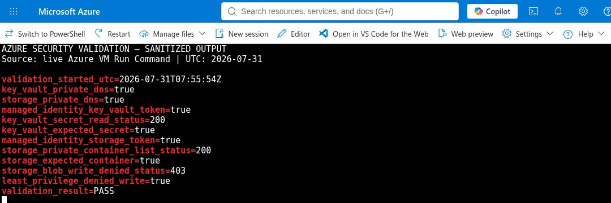
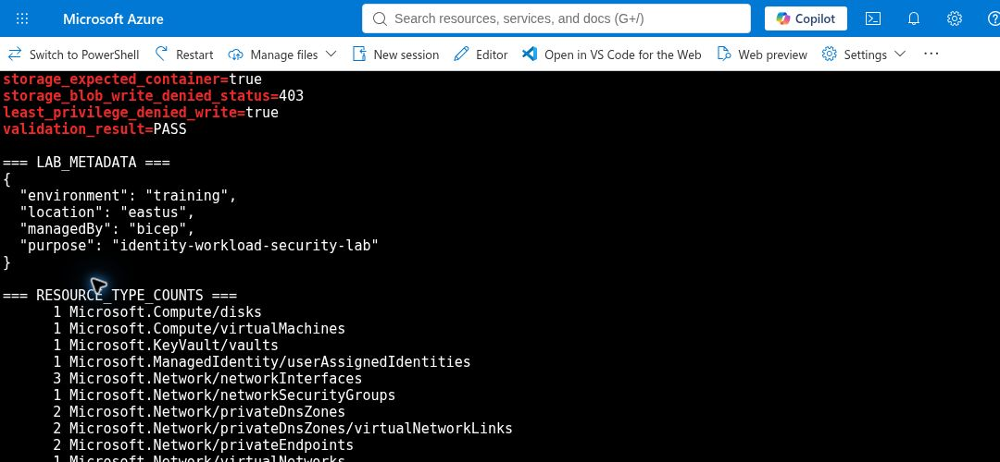
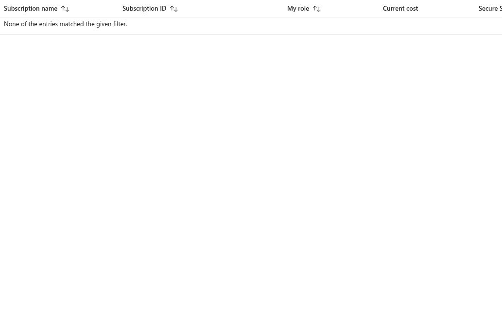

# CareBridge Azure Identity & Workload Security Lab

A compact Azure security lab that connects Microsoft Entra identity controls to a protected workload for CareBridge Analytics, a fictional healthcare SaaS team.

The scenario stays deliberately small: the team needs controlled administrator access, a workload identity with no stored credentials, private access to secrets and storage, and enough logging to prove the controls worked. This shows hands-on cloud security practice after SC-300 and SC-500 study. It is not presented as production or enterprise architecture experience.

> **Current state:** the approved East US workload was deployed and tested on 2026-07-31. Private DNS, managed-identity reads, the expected denied Blob write, and Log Analytics ingestion passed. The temporary VM, disk, and network interface were removed, followed by verified deletion of the full resource group. The Azure workload portion is complete. Entra group authorization and license-dependent Conditional Access testing are still pending because the tested directory did not allow group administration. See [findings and fixes](docs/05-findings-and-fixes.md).

## Five-minute reviewer path

1. Start with the [managed-identity and private-path result](evidence/exports/azure-workload-validation.md).
2. Check the [monitoring result](evidence/exports/monitoring-validation.md) to confirm logs reached Log Analytics.
3. Read the [cleanup verification](evidence/exports/cleanup-verification.md), including the failed safety check and successful retest.
4. Finish with [finding F-02](docs/05-findings-and-fixes.md#f-02--current-directory-principal-could-not-create-groups) for the Entra work that is still open.

The failed prechecks stay in the repository on purpose. Azure had already supplied enough plot twists; quietly deleting the inconvenient parts would not improve the lab.

## What this lab is designed to prove

| Security question | Planned control | Evidence rule |
|---|---|---|
| Who should administer the lab? | Entra security groups and least-privilege Azure RBAC | Sanitized group and role-assignment exports |
| How is risky sign-in policy introduced safely? | Conditional Access in report-only mode with an emergency-access exclusion, when licensing permits | Portal policy summary and sign-in evaluation |
| How does the workload authenticate? | User-assigned managed identity | Identity sign-in and resource access test |
| Can the workload reach secrets and data without public endpoints? | Key Vault and Storage private endpoints, private DNS, and network restrictions | Configuration export plus a successful private-path test |
| Can a reviewer verify what happened? | Diagnostic settings, Log Analytics, and focused KQL | Query text and sanitized result screenshot |

## Intended architecture

The temporary validation workload exists only long enough to prove that the managed identity can use the private data path. It is then removed to control cost.

## Live validated evidence

These images are cropped captures from the real Azure Cloud Shell session. The text exports are the primary evidence because they document the source, time, security claim, limits, and redactions.

<table>
  <tr>
    <td align="center">
       
      E-07: private path, allowed reads, and expected HTTP 403 write
    </td>
    <td align="center">
       
      E-04: live lab metadata and deployed resource types
    </td>
  </tr>
</table>

- [Read the workload validation evidence](evidence/exports/azure-workload-validation.md).
- [Read the monitoring evidence](evidence/exports/monitoring-validation.md).
- [Read the cleanup evidence](evidence/exports/cleanup-verification.md).

## Live precheck evidence

These are real, sanitized historical prerequisite checks—not simulated control results. They remain visible because they explain the account changes and guardrails that were required before the successful what-if.

<table>
  <tr>
    <td align="center">
       
      P-01: no Azure subscription
    </td>
    <td align="center">
       
      P-02: group administration denied
    </td>
  </tr>
</table>

The alternate-account membership failure is recorded as sanitized text evidence. These blockers remain because they show why account-context checks and exact cleanup guards were added; they are history, not current workload status.

## Repository tour

- [`docs/01-scope-and-threat-model.md`](docs/01-scope-and-threat-model.md) defines the scenario, assumptions, and control boundaries.
- [`docs/skills-map.md`](docs/skills-map.md) maps implemented artifacts to SC-300 and SC-500 skill areas without turning exam objectives into experience claims.
- [`docs/06-deployment-runbook.md`](docs/06-deployment-runbook.md) provides the guarded preview, deployment, validation, and cleanup sequence.
- [`docs/references.md`](docs/references.md) lists the Microsoft guidance used for the controls.
- [`notes/lab-journal.md`](notes/lab-journal.md) records dated work sessions, failures, decisions, fixes, and retests.
- [`evidence/README.md`](evidence/README.md) is the evidence index and redaction standard.
- `infra/`, `queries/`, and `scripts/` provide the implementation and validation workflow; live results remain separate evidence.

## Evidence standard

Screenshots and exports in this repository must come from the real lab tenant or subscription. Tenant IDs, subscription IDs, object IDs, personal email addresses, IP addresses, secrets, tokens, and billing details are removed. Architecture illustrations explain the design; they are not presented as proof.

## Boundaries

- This is an isolated learning environment, not a production tenant.
- Entra Conditional Access, PIM, and access reviews depend on the available tenant license. Unavailable features stay explicitly marked as not implemented.
- A passing deployment is not treated as proof of effective security. Each implemented control needs a configuration check or access test.
- No synthetic portal screens, invented incidents, or backdated work history are used.

## Cost and cleanup

The validation VM was removed immediately after access testing, including its disk and validation interface. The guarded full cleanup then deleted the resource group, and a separate Azure CLI check returned `false` for group existence and zero active resources in the lab group. The purge-protected Key Vault name remains reserved during its seven-day soft-delete period.

## License

[MIT](LICENSE)
